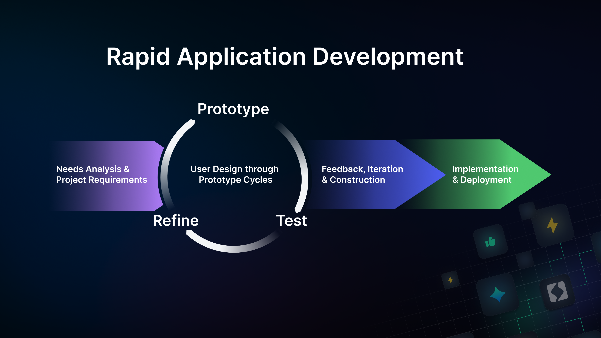
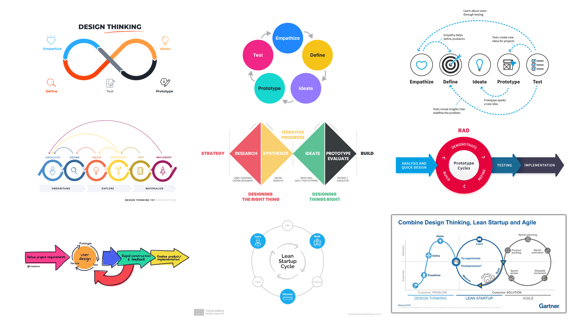

### **The Challenge of Change**

The pace of innovation is relentless. Organizations today find themselves in a race to adapt to new technologies, shifting consumer demands, and evolving or opaque regulations. Yet, the traditional methods of building and maintaining software systems often lag behind the speed of change, creating bottlenecks that stifle growth and innovation.

The pace of innovation often outstrips an organization’s ability to adapt, keep up with rapidly changing requirements, shifting goals, and technological advancements.

<!-- truncate -->

Across many industries, this comes down to a familiar struggle of common trade-offs in product and solution development. 

**\- Speed vs. Accuracy:** The balance between haste or precision  
**\- Customizability vs. Scalability:** Meeting specific needs or relentless standardisation 

As businesses push to innovate, they face a crucial question: how can they accelerate development without sacrificing quality or flexibility?

---

### **The Power of Accelerated Development**

The answer lies in embracing methodologies that prioritize agility and adaptability. Rapid Application Development (RAD) represents a fundamental shift in how organizations approach software and workflow creation. It is not just a faster way to build systems—it’s a way to empower teams to iterate, test, and refine their ideas with unprecedented efficiency.

Key benefits of RAD include:

* **Rapid Prototyping**: Organizations can quickly test ideas without committing to large-scale development, allowing for faster feedback and iteration.  
* **Iterative Development**: Instead of delivering a finished product all at once, RAD emphasizes incremental improvements, reducing the risk of misaligned expectations.  
* **Adaptability to Change**: By designing with flexibility in mind, RAD allows organizations to pivot and respond to new demands or challenges with ease.

These principles have been widely embraced in industries ranging from DAO’s, incubators, tech startups to multinational corporations (in the case of the latter often with the help of a high ticket consultant). Other methodologies from adjacent domains of RAD, that you might be more familiar with include: 

* **Lean Start-up Methodology**: Focussing on finding product market fit early with a minimum viable product through a build, measure, learn cycle.   
* **Pre-totyping:** A method by Google's first engineering director focused on validating that you are building the ‘right it’ before you ‘build it’ right with the help of smoke tests or mock-ups.   
* **Design-thinking:** Where designers & developers go through non-linear, iterative processes of discovery, definition, development & delivery of their ideas with the help of prototyping together with end-users.

*Figure 1: Notice how  Design thinking, Lean Startup Methodology and Rapid Application Development all rely on tooling that put rapid iteration at the center of the methodology? It remains crucial to select the right tool with the correct prototype fidelity at any of the stages these methodologies prescribe*

---

### **Why Traditional Methods Fall Short**

Despite their success in simpler times, traditional development methodologies are currently often falling short in today’s dynamic environments.

* **Long Lead Times**: Developing complex systems from scratch can take months or even years, by which time business requirements may have shifted.  
* **Limited Customization**: Off-the-shelf solutions may be fast to deploy but rarely align perfectly with an organization’s unique workflows.  
* **High Costs of Change**: Adjusting systems mid-development often incurs significant costs and delays, making organizations hesitant to pivot.

To overcome these challenges, businesses need a new approach—one that combines speed, flexibility, and precision.

---

### **How Powerhouse Bridges the Gap**

Powerhouse is proposing a framework built to address these very challenges, offering a platform that marries the speed of RAD with the depth of customization modern organizations demand.

At the core of Powerhouse’s approach is its **document model-driven architecture**, a GraphQL schema based foundation that reimagines how data, workflows, and processes are structured. This architecture enables organizations to:

* **Capture Data Effectively**: Modular document models allow organizations to define and adapt workflows with higher accuracy.   
* **Automate Workflows**: With tools to streamline even the most complex processes, so organizations can focus on innovation instead of repetitive tasks.  
* **Iterate and Evolve Rapidly**: Modular, reusable components reduce development times, enabling organizations to adapt to their most pressing challenges and changes. 

---

### **From a front-end developers perspective**

>“The coolest part is being able to plug into any document model and start building UI components for it without the hassle of managing a 'backend' or 'state management' for the components. All front-end devs use and love redux, the event driven architecture these document models are using. But the fact that as a front end dev, you don't have to set up any of it, and can just plug into the underlying framework saves time. It allows me to focus on my actual tasks \- building awesome UI components and experiences. I could start thinking of the same document model but with a 1000 different UI’s depending on the user's specific needs and preferences. Like swapping skins in my favorite video game”

The rapid application development process we’re setting up, allows us to move quicker from initial problem definition to potential prototype opens up time for designers and developers to actually test and iterate on their imagined solution. 

By prioritizing rapid, iterative development, Powerhouse aims to empower organizations to innovate faster, adapt more seamlessly, and achieve sustainable growth in even the most challenging environments.
