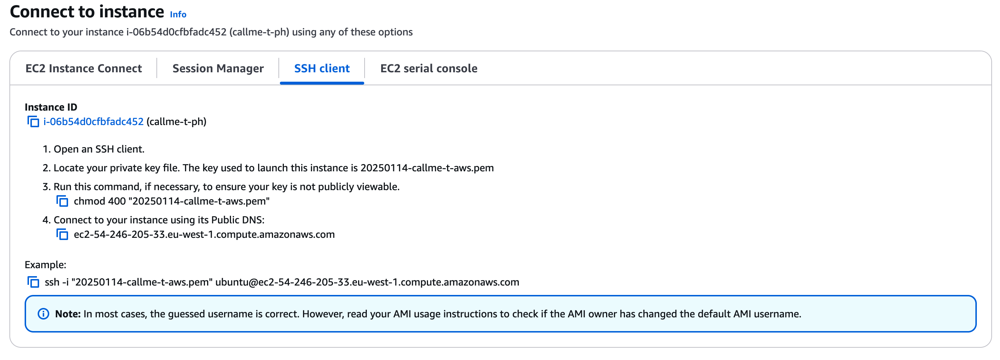

# Run Your Powerhouse Project on a EC2 instance

## Tutorial Workflow

This tutorial guides you through the process of deploying your Powerhouse project on a cloud server.

To help you navigate the steps involved, the diagram below illustrates the overall workflow. It shows the different environments and actions we'll cover.


Understanding this process is key because, within the Powerhouse ecosystem, users typically start by installing pre-built packages onto their Connect or Switchboard instances. These packages are often sourced from a central repository, similar to an app store. In the previous tutorial, we have [created and published our package](/docs/academy/Launch/PublishYourProject) on the Node Package Manager (NPM) registry as our "app store", and now you'll learn how to deploy your own package to a cloud environment.

## 1. Setting up your cloud environment
### 1.1. Launching your server instance (AWS \- EC2 \- Ubuntu)

Let's have a look at how to set up Connect & Switchboard apps on a cloud server.
Ask your IT provider to get access to the AWS environment to set up a server.
Launch a new server instance for Connect and Switchboard with the specific specs that fit your project.

The steps to create an EC2 instance:
   - Make sure your region is set to eu-west-1 (Ireland)
   - Name your instance something like `cloud-server` or your project's name
   - Select Ubuntu 24.04 LTS
   - Architecture 64-bit (x86)
   - Scroll down to Instance type and select t2.medium (recommended)
      - 2 vCPUs and 4 GiB of memory are the recommended minimum specs
      - For larger projects or higher load, consider t2.large or t2.xlarge
   - Create a new key pair and save it in a secure location from which you can connect to your instance with the SSH client later.
   - Configure the security group to allow inbound traffic:
      - SSH (Port 22) from your IP address
      - HTTP (Port 80) from anywhere
      - HTTPS (Port 443) from anywhere
      - Custom TCP (Port 8442) for Connect
      - Custom TCP (Port 8441) for Switchboard
   - **Launch the instance**

Now click on your instance ID, which will open a new window with the instance details. Hit the 'Connect' button to get the connection details.
Within the instance details, you'll find the public IP address of your server instance. We'll use this to connect to our server instance later.

:::warning
Make sure to keep your key pair file (.pem) secure and never share it. Without it, you won't be able to access your instance. Also, consider setting up AWS IAM roles and policies for better security management.
:::

### 1.2. Setting up your SSH connection

Once you've generated your key pairs and added them to the designated folder, you can set up the SSH connections to start the process.

SSH, which stands for **Secure Shell**, is a cryptographic network protocol used to securely access and manage devices over an unsecured network. It provides a secure channel over an unsecured network by using encryption, ensuring that data transmitted between your computer and the server remains confidential and tamper-proof.

To establish an SSH connection, you'll typically use an SSH client. On Unix-like systems (Linux, macOS), the SSH client is usually pre-installed.
Follow the instructions for the AWS instance you've configured with Ubuntu and set up your connection by adding the necessary commands in your terminal.



Your Ubuntu instance is usually always a little out of date. So use the following commands to get it up to speed.

   ```bash
   sudo apt update && sudo apt upgrade
   ```

### 1.3. Installing the required software with a script

Now that we've connected to our Ubuntu instance, we'll need to install the necessary services on our server to get things going, such as NVM, Node, NPM, etc.

For this, our team has set up a small script that will help you to automate a series of installations.

Enter the base command, which will start installing the necessary services on your server by downloading the install script and running it directly in the bash shell for execution.

   ```bash
   curl -o- https://raw.githubusercontent.com/powerhouse-inc/powerhouse/refs/heads/main/clis/ph-cli/scripts/setup.sh | bash
   ```

The script contains the following commands and will help you set up a series of services on your server.

- **NVM**: Node Version Manager for managing Node.js versions
- **Node.js**: JavaScript runtime
- **PM2**: Process manager for Node.js applications
- **ph-cmd**: Powerhouse CLI tool for managing projects.
- **pnpm**: Fast, disk-space-efficient package manager

:::info
ph-cmd is a tool that helps you manage your Powerhouse projects. It's a command-line interface package that you can install globally on your server and personal machine.
It gives you access to a series of powerful commands to create or manage your projects, start or stop your services, install your project on a server instance, etc. Visit this page to learn more about the [Powerhouse builder tooling](./docs/academy/Create/BuilderTools)
:::

Let's have a look at the other commands that are part of the script that will help you install the necessary services on your server.

   #### 1. Load NVM into the current shell session
   ```bash
   export NVM_DIR="$HOME/.nvm"
   [ -s "$NVM_DIR/nvm.sh" ] && \. "$NVM_DIR/nvm.sh"  
   ```

   #### 2. Checks if the file nvm.sh exists and loads it if the condition is true.
   ```bash
   [ -s "$NVM_DIR/bash_completion" ] && \. "$NVM_DIR/bash_completion"  
   ```
   #### 3. Loading & Verifying NVM
   ```bash
   nvm --version
   ```

   #### 4. Install Node.js by using NVM
   ```bash
   nvm install 22
   ```

   #### 5. Install pnpm package manager globally
   ```bash
    nvm install 22
   pnpm setup
   source $HOME/.bashrc
   ```
   Now follow the instructions of your Ubuntu server at the end of the installation.

   #### 6. Install Powerhouse CLI 'globally' using pnpm, making it available for command-line use anywhere. This makes it available for command-line use anywhere, not just locally within the project directory.

   ```bash
   pnpm install -g ph-cmd
   ```

## 2. Deploying the host apps & project. 

Now that we've installed all the necessary services on our server instance, we can start deploying the host apps & our packaged project from npm.

1. **Install your project package** that we published earlier on npm, onto the server instance.
	   ```bash
	   ph install @your-org/package-name
	   ```

2. **Start the Connect service** so that we can start interacting with our project.
	```bash
	ph connect --https --port 8442
	```
	Let's verify that the Connect service is running. Since we can't make use of localhost and we're running the Connect service on the server instance, we'll need to use the public IP address of our server instance to start interacting with our project. Copy the public IP address of your server instance and paste it into your browser. Now add the port `:8442` to the end of the URL and you should see your project running.

   Create a new document and start interacting with it. Add a new item to the list so you can query the document through the GraphQL playground in Switchboard in the next step.

3. **Start the Switchboard service** and run the following command to boot the Reactor.
	```bash
	ph switchboard --port 8441
	```
	Let's verify that the Reactor has detected your project and is ready to start by navigating to the GraphQL playground.
   Since we can't make use of localhost and we're running the Switchboard service on the server instance, we'll need to use the public IP address of our server instance to start interacting with our project. Copy the public IP address of your server instance and paste it into your browser. Now add the port `:8441` to the end of the URL and you should get access to the GraphQL playground.


## 3. Setup the host apps as system services

Now that we've installed the host apps and our project on the server instance, we'll configure them to run as system services. This ensures that:
- Services automatically start when the server boots up
- Services automatically restart if they crash
- Services continue running after you log out of SSH
- System resources are properly managed through PM2

### 3.1. Register services for automatic startup

Use the following command to register both Connect and Switchboard as system services:

```bash
ph service startup
```

To remove the services from automatic startup:

```bash
ph service unstartup
```
<details>
<summary>Read the ph service --help command</summary>

Usage: ph service [options] `<action>` [service]

Manage services


Command Overview:
  The service command manages Powerhouse services, allowing you to start, stop, check status,
  and more. It provides a centralized way to control the lifecycle of services in your project.

  This command:
  1. Controls service lifecycle (start, stop, status, etc.)
  2. Manages multiple services from a single interface
  3. Provides detailed information about running services
  4. Uses PM2 under the hood for process management

Arguments:
  `<action>`              The action to perform. Available actions:
                        - start: Launch the specified service
                        - stop: Terminate the specified service
                        - status: Check the current status of services
                        - list: List all managed services (default)
                        - startup: Configure services to start on system boot
                        - unstartup: Remove services from system startup
                        
  [service]             Optional. The service to act upon. Available services:
                        - switchboard: The document processing engine
                        - connect: The Connect Studio interface
                        - all: Act on all services (default)

Examples:
  $ ph service                               # List all services (same as 'ph service list all')   
  $ ph service start switchboard             # Start the Switchboard service   
  $ ph service stop connect                  # Stop the Connect service   
  $ ph service start all                     # Start all services   
  $ ph service status                        # Check status of all services   
  $ ph service startup                       # Configure services to start on system boot   
  $ ph service unstartup                     # Remove services from system startup   

Notes:
  - Services are managed using PM2, a process manager for Node.js applications
  - The 'status' action shows uptime, memory usage, CPU usage, and other metrics
  - The 'list' action is the default when no action is specified
  - The 'all' service is the default when no service is specified

  </details>

### 3.2. Managing individual services

You can control each service independently:

```bash
# Start individual services
ph service start connect     # Starts only Connect
ph service start switchboard # Starts only Switchboard

# Stop individual services
ph service stop connect      # Stops only Connect
ph service stop switchboard  # Stops only Switchboard
```

### 3.3. Managing all services together

To control both services at once:

```bash
ph service start  # Starts both Connect and Switchboard
ph service stop   # Stops both Connect and Switchboard
```

:::tip
You can check the status of your services at any time using:
```bash
ph service status
```
This will show you if services are running, their uptime, and resource usage.
:::

:::warning
After making any configuration changes to your project, remember to restart the affected services for the changes to take effect.
:::

## 4. Verify your project is running on your server

- Open the server domain in your browser, and you should see your project running.
- Verify that synchronization is working and your document is available.
- Try to make a change to your document and see if it's reflected in another instance with that same document.
- Query the document through the GraphQL playground.

Congratulations! You've now published your project and are ready to start collaborating with your team on the same document models and editors!