# Getting Started with Reactor

## Introduction

Welcome to the Powerhouse Reactor system (aka document-drive). Reactor is a powerful document management and synchronization engine designed to handle collaborative workflows across distributed systems. As a core component of the Powerhouse platform, Reactor provides robust capabilities for document creation, storage, versioning, and real-time collaboration.

Reactor enables applications to work with structured documents in a collaborative and reactive way. It maintains document state through a series of operations, supports versioning, and handles synchronization across multiple clients and servers.

## Documents

The Reactor system is built around the concept of documents. Documents are the core data structure that Reactor manages, and they can be organized hierarchically. Documents that hold other documents are called **drives**.

> Note (Prometheus): Simplify



**Operations** are the mechanism by which documents are modified. When a client wants to change a document, it sends operations to the Reactor, which applies them to the document.


When a client requests a document, the Reactor reconstructs it by applying all of its operations in sequence, resulting in the current state of the document.



## Document Models

Document models are structured descriptions that define both the shape of a document and the operations that can be applied to it. They serve as blueprints for creating and manipulating documents within the Reactor system.

Each document model specifies:
- The document's data schema: fields and types
- Valid operations that can modify the document
- Rules for how operations transform the document state

Document models in the Reactor system are themselves documents. This self-describing pxroperty allows document models to be stored, versioned, and synchronized using the same mechanisms as any other document in the system.

When creating a new document, you must specify which document model it follows. The Reactor then ensures that all operations applied to that document conform to the rules defined by its model.

> Note (Prometheus): Document Model is generated from a Document Model Specification


## Data Objects

Reactor is built around a well-defined data model that represents documents, operations, and the relationships between them.


#### PHDocument

The core entity representing a **document**. Each document:

- Has a unique `id`
- Contains `revision` information
- Maintains a collection of "_scopes_" (more on this later)
- Stores a specific `documentType` that defines its structure

> Note: Add branch concept.

#### Drive

Drives are themselves documents that also have a collection of documents:

- Documents can belong to multiple drives through a many-to-many relationship
- Drives provide an organizational structure for documents

#### Operation

Operations represent changes to documents:

- Each operation is applied to a specific `document`, `scope`, and `branch`
- Operations are ordered sequentially with indexing
- They contain the input data that represents the parameters for the intended change
- Operations are used to rebuild document state and track history

## System Architecture

The Reactor system orchestrates document operations through a well-defined flow of components.


The architecture consists of several key components:

1. **Client Applications**: Interact with the system through the GraphQL API.
2. **GraphQL Layer**: Provides a standardized interface for client applications.
3. **Queue**: Ensures operations are processed in the correct order.
4. **Operation Processor**: Applies operations to documents and maintains document state.
5. **Storage**: Persists documents, operations, and system state.
6. **Listeners**: Monitor for changes and facilitate real-time updates.
7. **Synchronization**: Coordinates document state across distributed systems.

### Usage (GraphQL API)

> Note (Prometheus): Prerequisites, like gql install.
> Note (Prometheus): Show GQL next to Typescript in Docusaurus.

The GraphQL API is the primary way to interact with the Reactor when it's running as a service. This API provides a standardized interface for client applications.

First, we'll retrieve the supported document models:

```typescript
import { gql } from '@apollo/client';

const GET_DOCUMENT_MODELS = gql`
  query GetDocumentModels {
    documentModels {
      name
      id
      extension
      description
      author {
        name
        website
      }
    }
  }
`;

async function fetchAvailableDocumentModels() {
  const { data } = await client.query({
    query: GET_DOCUMENT_MODELS
  });
  
  console.log(`Found ${data.documentModels.length} document models`);
  
  // Log model names and extensions
  data.documentModels.forEach(model => {
    console.log(`Model: ${model.name} (.${model.extension})`);
  });
}
```

You can also check if a specific model is supported by querying for it directly:

```typescript
import { gql } from '@apollo/client';

const GET_SPECIFIC_MODEL = gql`
  query GetDocumentModel($modelName: String!) {
    documentModel(name: $modelName) {
      name
      id
      extension
      description
      author {
        name
      }
    }
  }
`;

async function checkModelSupport(modelName) {
  const { data } = await client.query({
    query: GET_SPECIFIC_MODEL,
    variables: { modelName }
  });
  
  if (data.documentModel) {
    console.log(`Model ${data.documentModel.name} is supported`);
    return true;
  } else {
    console.log(`Model ${modelName} is not supported`);
    return false;
  }
}

// Check if a specific model is supported before trying to use it
async function useModelIfSupported() {
  const isMarkdownSupported = await checkModelSupport('markdown-document');
  
  if (isMarkdownSupported) {
    // Proceed with document creation
    createMarkdownDocument();
  } else {
    console.error('Cannot create document: markdown model not supported by this Reactor');
  }
}
```

Next, we can create a new document:

> Note (Prometheus): +branch, scope

```typescript
import { gql } from '@apollo/client';

const CREATE_DOCUMENT = gql`
  mutation CreateDocument($input: CreateDocumentInput!) {
    createDocument(input: $input) {
      id
      revision
      name
      slug
      documentType
      scopes {
        name
        state
      }
    }
  }
`;

async function createNewDocument() {
  const result = await client.mutate({
    mutation: CREATE_DOCUMENT,
    variables: {
      input: {
        driveId: 'drive-123',
        documentType: 'task-list',
        name: 'Sprint Planning',
        slug: 'sprint-planning-q2',
        initialState: {
          global: {
            title: 'Q2 Sprint Planning',
            tasks: []
          }
        }
      }
    }
  });
  
  const newDocument = result.data.createDocument;
  console.log(`Created document ${newDocument.name} with ID ${newDocument.id}`);cument.id);
}
```

We can also subscribe to changes in the document:

```typescript
function subscribeToDocumentChanges(documentId) {
  const subscription = client.subscribe({
    query: gql`
      subscription OnDocumentChanged($id: ID!) {
        documentChanged(id: $id) {
          id
          revision
          scopes {
            name
            state
          }
        }
      }
    `,
    variables: { id: documentId }
  });
  
  subscription.subscribe(({ data }) => {
    console.log('Document updated:', data.documentChanged);
    
    // Eg - blast Discord, send an email, etc
  });
}
```

We can also search for documents. This can be by id:

```typescript
import { gql } from '@apollo/client';

const GET_DOCUMENT_BY_ID = gql`
  query GetDocument($id: String!) {
    document(id: $id) {
      id
      name
      slug
      documentType
      created
      lastModified
      revision
      # Fields specific to the document type can be requested in fragments
      ... on MarkdownDocument {
        state {
          global {
            content
          }
        }
      }
    }
  }
`;

async function fetchDocumentById(documentId) {
  const { data } = await client.query({
    query: GET_DOCUMENT_BY_ID,
    variables: { id: documentId }
  });
  
  if (data.document) {
    console.log(`Found document: ${data.document.name}`);
    return data.document;
  } else {
    console.log(`Document with ID ${documentId} not found`);
    return null;
  }
}
```

By slug:

```typescript
import { gql } from '@apollo/client';

const GET_DOCUMENT_BY_SLUG = gql`
  query GetDocumentBySlug($slug: String!) {
    documentBySlug(slug: $slug) {
      id
      name
      slug
      documentType
      created
      lastModified
      revision
      # Fields specific to the document type can be requested in fragments
      ... on MarkdownDocument {
        state {
          global {
            content
          }
        }
      }
    }
  }
`;

async function fetchDocumentBySlug(slug) {
  const { data } = await client.query({
    query: GET_DOCUMENT_BY_SLUG,
    variables: { slug }
  });
  
  if (data.documentBySlug) {
    console.log(`Found document: ${data.documentBySlug.name}`);
    return data.documentBySlug;
  } else {
    console.log(`Document with slug ${slug} not found`);
    return null;
  }
}
```

Or we can pull all the documents in a drive:

```typescript
import { gql } from '@apollo/client';

const GET_DRIVE_DOCUMENTS = gql`
  query GetDriveDocuments {
    documents {
      id
      name
      slug
      documentType
      created
      lastModified
    }
  }
`;

async function fetchAllDriveDocuments() {
  const { data } = await client.query({
    query: GET_DRIVE_DOCUMENTS
  });
  
  if (data.documents && data.documents.length > 0) {
    console.log(`Found ${data.documents.length} documents in drive`);
    data.documents.forEach(doc => {
      console.log(`- ${doc.name} (${doc.documentType})`);
    });
    return data.documents;
  } else {
    console.log('No documents found in drive');
    return [];
  }
}
```

### Usage (TypeScript)

> Note (Prometheus): Just need a list of functions and their return types (do this FIRST).

For applications that embed the Reactor directly, the TypeScript API provides direct access to the document drive server.

First, let's retrieve the supported document models:

```typescript
const reactor: IReactor = getReactor();
const client: IReactorClient = new ReactorClient(reactor);

const { results } = await client.getDocumentModels();

console.log(`Found ${results.length} document models`);

const model = results.find(m => m.name === "task-list");

if (!model) {
  console.log(`Model ${modelName} is not supported`);
  exit(1);
}

let workList = await client.create<TaskListDocument>(
  createDocument({ slug: "work" }),
);

console.log(`Created document ${workList.name} with ID ${workList.id}`);

// change the document
workList = await client.mutate(
  workList.id,
  [addTodo({ name: "Call Stephen" })],
);

const { document: homeList } = await client.get<TaskListDocument>("home");

console.log(`Document ${homeList.name} has ${homeList.state.global.todos.length} todos`);

// put everything in a drive
const drive = await client.create<DriveDocument>(
  createDocument({ slug: "mine" }),
);

await client.addChildren(
  drive.id,
  [workList.id, homeList.id],
);

// get all my other todos
let all = [];
let next = () => client.find({ type: "task-list" }, { limit: 100 });

while (next) {
  const { results, next: nextPage } = await next();
  all.push(...results);

  next = nextPage;
}

// add to this drive
await client.addChildren(
  drive.id,
  all,
);
```

