# Getting Started with Reactor

## Introduction

Welcome to the Powerhouse Reactor system (aka document-drive). Reactor is a powerful document management and synchronization engine designed to handle collaborative workflows across distributed systems. As a core component of the Powerhouse platform, Reactor provides robust capabilities for document creation, storage, versioning, and real-time collaboration.

Reactor enables applications to work with structured documents in a collaborative and reactive way. It maintains document state through a series of operations, supports versioning, and handles synchronization across multiple clients and servers.

## Models

Reactor is built around a well-defined data model that represents documents, operations, and the relationships between them.

This is a good place to start understanding the full Reactor, as the entire system is designed around managing document state in a distributed environment.

### Entity Relationship Model



#### PHDocument

The core entity representing a document in the system. Each document:

- Has a unique `id`
- Contains `revision` information
- Maintains a collection of "scopes" (more on this later)
- Stores specific `documentType` that defines its structure

#### Drive

Drives are themselves documents that also have a collection of documents:

- Documents can belong to multiple drives through a many-to-many relationship
- Drives provide an organizational structure for documents

#### Operation

Operations represent changes to documents:

- Each operation is applied to a specific `document` and `scope`
- Operations are ordered sequentially with indexing
- They contain the input data that represents the parameters for the intended change
- Operations are used to rebuild document state and track history

## Reactor System

The Reactor system orchestrates document operations through a well-defined flow of components.

### System Architecture



The architecture consists of several key components:

1. **Client Applications**: Interact with the system through the GraphQL API.
2. **GraphQL Layer**: Provides a standardized interface for client applications.
3. **Queue**: Ensures operations are processed in the correct order.
4. **Operation Processor**: Applies operations to documents and maintains document state.
5. **Storage**: Persists documents, operations, and system state.
6. **Listeners**: Monitor for changes and facilitate real-time updates.
7. **Synchronization**: Coordinates document state across distributed systems.

### Usage (Graph API)

The GraphQL API is the primary way to interact with the Reactor when it's running as a service. This API provides a standardized interface for client applications.

First, we'll retrieve the supported document models:

```typescript
import { gql } from '@apollo/client';

const GET_DOCUMENT_MODELS = gql`
  query GetDocumentModels {
    documentModels {
      name
      id
      extension
      description
      author {
        name
        website
      }
    }
  }
`;

async function fetchAvailableDocumentModels() {
  const { data } = await client.query({
    query: GET_DOCUMENT_MODELS
  });
  
  console.log(`Found ${data.documentModels.length} document models`);
  
  // Log model names and extensions
  data.documentModels.forEach(model => {
    console.log(`Model: ${model.name} (.${model.extension})`);
  });
}
```

You can also check if a specific model is supported by querying for it directly:

```typescript
import { gql } from '@apollo/client';

const GET_SPECIFIC_MODEL = gql`
  query GetDocumentModel($modelName: String!) {
    documentModel(name: $modelName) {
      name
      id
      extension
      description
      author {
        name
      }
    }
  }
`;

async function checkModelSupport(modelName) {
  const { data } = await client.query({
    query: GET_SPECIFIC_MODEL,
    variables: { modelName }
  });
  
  if (data.documentModel) {
    console.log(`Model ${data.documentModel.name} is supported`);
    return true;
  } else {
    console.log(`Model ${modelName} is not supported`);
    return false;
  }
}

// Check if a specific model is supported before trying to use it
async function useModelIfSupported() {
  const isMarkdownSupported = await checkModelSupport('markdown-document');
  
  if (isMarkdownSupported) {
    // Proceed with document creation
    createMarkdownDocument();
  } else {
    console.error('Cannot create document: markdown model not supported by this Reactor');
  }
}
```

Next, we can create a new document:

```typescript
import { gql } from '@apollo/client';

const CREATE_DOCUMENT = gql`
  mutation CreateDocument($input: CreateDocumentInput!) {
    createDocument(input: $input) {
      id
      revision
      name
      slug
      documentType
      scopes {
        name
        state
      }
    }
  }
`;

async function createNewDocument() {
  const result = await client.mutate({
    mutation: CREATE_DOCUMENT,
    variables: {
      input: {
        driveId: 'drive-123',
        documentType: 'task-list',
        name: 'Sprint Planning',
        slug: 'sprint-planning-q2',
        initialState: {
          global: {
            title: 'Q2 Sprint Planning',
            tasks: []
          }
        }
      }
    }
  });
  
  const newDocument = result.data.createDocument;
  console.log(`Created document ${newDocument.name} with ID ${newDocument.id}`);
  
  // Subscribe to document changes
  subscribeToDocumentChanges(newDocument.id);
}

function subscribeToDocumentChanges(documentId) {
  const subscription = client.subscribe({
    query: gql`
      subscription OnDocumentChanged($id: ID!) {
        documentChanged(id: $id) {
          id
          revision
          scopes {
            name
            state
          }
        }
      }
    `,
    variables: { id: documentId }
  });
  
  subscription.subscribe(({ data }) => {
    console.log('Document updated:', data.documentChanged);
    // Update UI with new document state
    updateDocumentUI(data.documentChanged);
  });
}
```

### Usage (TypeScript)

For applications that embed the Reactor directly, the TypeScript API provides direct access to the document drive server.

We should start by retrieving the list of document models supported by the Reactor.

```typescript
// Get an instance of the document drive server
const reactor = getDocumentDriveServer();

// Retrieve all supported document models
const documentModelModules = reactor.getDocumentModelModules();
console.log(`Found ${documentModelModules.length} document models`);

// Log all model names and extensions
documentModelModules.forEach(module => {
  const model = module.documentModel;
  console.log(`Model: ${model.name} (.${model.extension})`);
});

// Find a specific model by name
const markdownModel = documentModelModules.find(
  module => module.documentModel.name === 'markdown-document'
);

if (markdownModel) {
  const model = markdownModel.documentModel;
  console.log(`Found model: ${model.name}`);
  
  // Get operations from the latest specification
  const latestSpec = model.specifications[model.specifications.length - 1];
  const operations = latestSpec.modules
    .flatMap(module => module.operations.map(op => op.name));
  
  console.log(`Available operations: ${operations.join(', ')}`);
}
```

Next, we want to create a new document using the TypeScript API:

```typescript
// Get the reactor instance
const reactor = getDocumentDriveServer();

// Create a drive first (if you don't already have one)
const drive = await reactor.addDrive({
  name: 'My Project Documents'
});

// Create a new document with initial state
const newDocument = await reactor.createDocumentWithState(
  drive.id,
  'markdown-document',
  {
    global: {
      content: '# Hello World\n\nThis is a new document.'
    }
  },
  { 
    name: 'Getting Started Guide',
    slug: 'getting-started'
  }
);

console.log(`Created document: ${newDocument.id}`);
console.log(`Access URL: /documents/${newDocument.slug}`);

// Add an operation to update the document
await reactor.addOperation(
  drive.id,
  newDocument.id,
  {
    type: 'updateContent',
    scope: 'global',
    branch: 'main',
    input: {
      content: '# Hello World\n\nThis is an updated document.'
    }
  }
);
```

Through these interfaces, applications can seamlessly integrate with the Reactor system to manage document-centric workflows, enabling collaborative document editing, versioning, and synchronization across distributed environments.