# Reactor Architecture

## Overview



- **IReactor**: The core server component that provides a simple, asynchronous interface for document operations. It uses a job-based approach where operations return a job ID and status that can be tracked to completion.

- **IReactorClient**: A wrapper component that makes the IReactor more ergonomic to use. It abstracts away job handling details and provides a more developer-friendly interface with methods that automatically wait for job completion. For example, while IReactor's `addChildren` returns a JobId, IReactorClient's version returns the updated document directly.

- **GraphQL API**: A separate component that implements resolvers for the Reactor functionality. It provides a standardized way to interact with the Reactor from web and mobile clients, exposing mutations and queries that map to the underlying Reactor operations.

## Topics


### ViewFilter

The `ViewFilter` object allows you to customize the data retrieves on one or more documents.

```typescript
type ViewFilter = {
  branch?: string;
  scopes?: string[];
  headerOnly?: boolean;
}
```

#### Usage

```typescript
// Get document from a specific branch
const view = await reactorClient.get(
  documentId,
  { branch: 'main' }
);

// Filter by scopes to get specific document content
const filteredView = await reactorClient.getChildren(
  parentId,
  { scopes: ['global', 'my-custom-scope'] }
);

// Combine all filters
const complexView = await reactorClient.find(
  { type: 'article' },
  { 
    branch: 'development', 
    scopes: ['public'],
  }
);

// Use the headers option to minimize data transfer
const headers = await reactorClient.getChildren(
  parentId,
  { headerOnly: true },
);
```

ViewFilters can significantly improve performance by:

- Using `headerOnly: true` when you only need document metadata
- Specifying only the `scopes` you need instead of fetching all document content

### Paging

The `PagedResults` object provides a consistent way to handle paginated data in the Reactor API. It's particularly useful when retrieving large collections of documents.

#### Usage

```typescript
// Define a function to fetch all documents of a certain type
async function fetchAllDocuments(reactorClient, documentType) {
  let allDocuments = [];
  
  let results = await reactorClient.find(
    { type: documentType },
  );
  
  do {
    allDocuments = allDocuments.concat(results.results);
    
    if (results.next) {
      results = await results.next();
    }
  } while (results.nextCursor);
  
  return allDocuments;
}

// Alternative approach using manual paging
async function manualPaging(reactorClient, documentType) {
  let allDocuments = [];
  let cursor = null;
  
  do {
    const pagingOptions = cursor ? { cursor, limit: 50 } : { limit: 50 };
    
    const results = await reactorClient.find(
      { type: documentType },
      { branch: 'main' },
      pagingOptions,
    );
    
    allDocuments = allDocuments.concat(results.results);
    
    cursor = results.nextCursor;
  } while (cursor);
  
  return allDocuments;
}
```

The PagedResults object includes:
- `results`: Array of items for the current page
- `nextCursor`: String token for the next page (null/undefined when done)
- `next()`: Convenience method to fetch the next page with the same parameters (null / undefined when done)
- `options`: The original paging options used for this request
