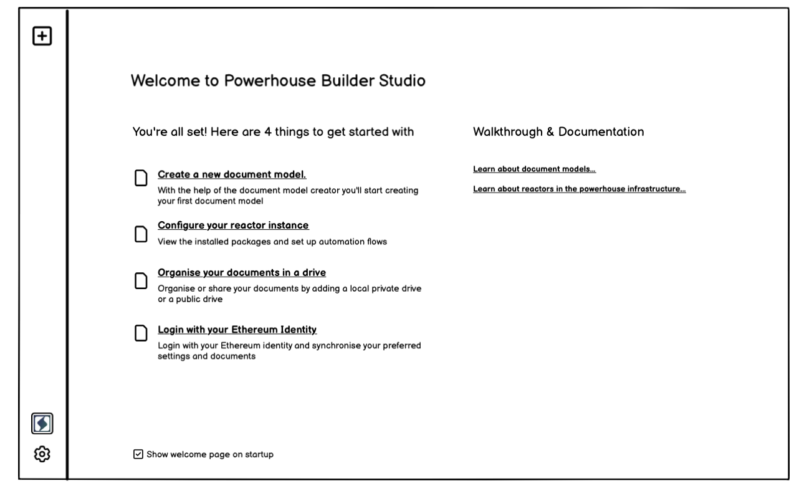

# Connect Studio Mode

The Connect Builder Studio is a robust tool designed for builders and developers to create, test, and deploy document models. The studio can be launched through a simple CLI command using the provided npm package. Once set up, the studio allows any developer or document model builder to run a local instance of the Connect hub on their machine and begin working immediately.

## Setup of the local reactor

:::info
Powerhouse Reactors are the nodes in the network that store documents, resolve conflicts and rerun operations to verify document event histories. Reactors can be configured for local storage, centralized cloud storage or on a decentralized storage network. The following page [Reactor component](docs/reactor/intro.md) offers more information about the reactor in the Powerhouse infrastructure.
:::

When using the Connect Builder Studio a local reactor will be spun up which will function as the back-end to your local Connect frond-end service. This local reactor will make use of your local document storage and will eventually be able to sync with other reactors on the network, or the Powergrid, you will set up.

## Document Model Creation

At the core of Connect Builder Studio is the Document Model Editor. This powerful editor enables business analysts, user researchers, or aspiring document model builders to craft a GraphQL schema that reflects the business domain the document model will operate in. The schema serves as the foundation of the document model, defining its structure and how it interacts with the broader business processes.

## Generating code for your document model

Once the document model is defined, the next step involves connecting a listener to the studio's reactor. This listener generates template code, which business analysts can use for a seamless handover to developers. The developer, using the generated template, can then proceed with the implementation of the necessary reducers, allowing the document model to function effectively within the system.

With this structured approach, Connect Builder Studio streamlines the collaboration between business analysts and developers, enhancing productivity and reducing the time needed to transition from model design to implementation.

## Let's get started

Connect Builder Studio can be spun up through CLI commands in your favorite IDE. The Connect builder studio offers an interface to add your graphql schema and configure the settings of your document model. 
Start with the following command to get started with the Powerhouse CLI

```
$ npm install powerhouse-cli
```

Your next step is to initialize the CLI with the following command. This will prompt the creation of a local configuratior file and accompagning reactor set up in .ph/documents.

```
$ npx ph init
```

To run a local version of the Connect Builder Studio use the following command

```
$ run npx ph connect
```

### Your first tasks in Connect Builder Studio



Let's start with the hard parts first: Building a new document model. 
You will be presented with two options.
1. To start from a blank document model 
or
2. Make use of a To Do List Document Model with a prefilled GraphQL schema. 

This document model forms the base of one of our introductionary tutorials which you can find here: [To Do List tutorial](/docs/category/todolist) 


### Defining your GraphQL Schema

### Setting up your listener and code generator

