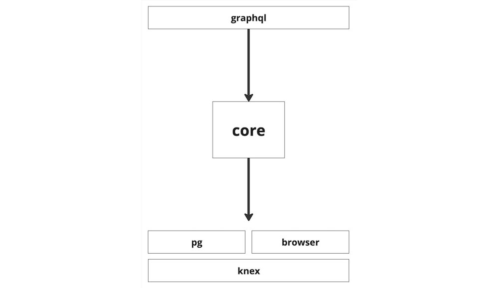
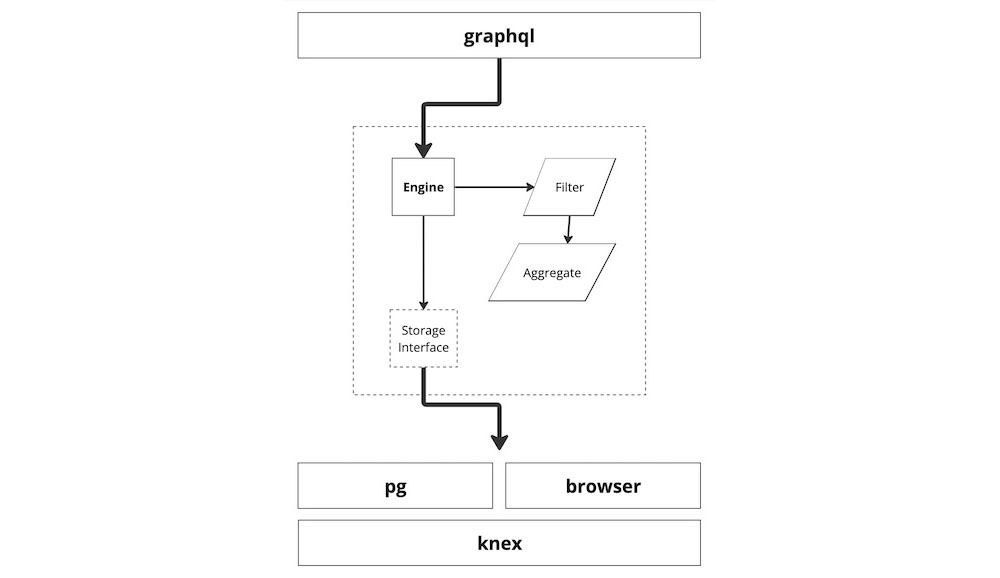

# Typescript API

## Overview

The analytics system is broken into several modules, allowing developers to deploy across many environments, for a diverse set of use cases.



The `core` library contains common data types and abstractions used throughout. The job of the core library is to link together query, storage, and aggregation logic.



The `knex`, `pg`, and `browser` libraries contain various storage implementations. Finally, the `graphql` library contains types, resolvers, and data types for a GraphQL API on top.

## Querying Data

The entry point for data queries in Typescript is the `AnalyticsQueryEngine`. This wraps an `IAnalyticsStore` implementation, which will be discussed in detail later.

In this example, we create a simple in-memory storage engine, compatible with all platforms.

```typescript
import { AnalyticsQueryEngine } from "@powerhousedao/analytics-core";
import { MemoryAnalyticsStore } from "@powerhousedao/analytics-memory";

const engine = new AnalyticsQueryEngine(new MemoryAnalyticsStore());
```

### AnalyticsQuery

Queries use the engine's `execute` function, taking an `AnalyticsQuery` parameter:

```typescript
type AnalyticsQuery = {
  start: DateTime | null;
  end: DateTime | null;
  metrics: string[];
  currency: AnalyticsPath;
  select: Record<string, AnalyticsPath[]>;
  granularity: AnalyticsGranularity;
  lod: Record<string, number | null>;
};
```

Each field plays a specific role in determining what data is returned by the analytics engine. Here's a clear and concise description of each:

- `start`: This is the starting date and time of the series, using Luxon types. See the [note about times](#a-note-about-times) for more information.

- `end`: This is the ending date and time of the series, using Luxon types. See the [note about times](#a-note-about-times) for more information.

- `metrics`: Specifies the particular metrics being queried (e.g., `"budget"`). Each element will refer to the `name` field on the related [`AnalyticsDimension` objects](../intro.md#series-and-dimensions).

- `currency`: A path reference to the currency to match (e.g. - `"usd"`).

- `select`: This object is a map from metric name to a list of paths (e.g. - `{ budget: ["/atlas"] }`). These paths are used for matching via the [`AnalyticsDimension` objects](../intro.md#series-and-dimensions).

- `granularity`: This field denotes the aggregation period for the data (e.g., `"monthly"`). A full list of options is available [here](../intro#granularity).

- `lod`: A map from metric name to the level of detail parameter (e.g. - `3`), described in detail [here](../intro.md#lods).

This query structure allows users to extract detailed and summarized analytics data. A full example will look like:

```typescript
const results = await engine.execute({
  start: DateTime.fromIso("2020-01-01T00:00:00.000Z"),
  end: "2100-01-01T00:00:00.000Z",
  currency: AnalyticsPath.fromArray(["DAI"]),
  metrics: ["Forecast"],
  select: {
    report: [AnalyticsPath.fromArray(["atlas", "EcosystemActor", "50", "2023", "11"])],
  },
  granularity: 0,
  lod: {},
});
```

This will return an array of `GroupedPeriodResult`.

### GroupedPeriodResult

This object is an aggregate. It represents a combined group of metrics over a time period.

```typescript
type GroupedPeriodResult = {
  period: string;
  start: DateTime;
  end: DateTime;
  rows: Array<{
    dimensions: Record<string, AnalyticsDimension>;
    metric: string;
    unit: string | null;
    value: number;
    sum: number;
  }>;
};
```

- `period`: Within each series, this field denotes the aggregation period for the data (e.g., `"monthly"`), with a short description of which month, year, quarter, etc.

- `start`: This is the starting date and time of the series, using Luxon types. See the [note about times](#a-note-about-times) for more information.

- `end`: This is the ending date and time of the series, using Luxon types. See the [note about times](#a-note-about-times) for more information.

- `rows`: Represents the individual records or entries in the data series. Each row corresponds to a unique combination of dimensions for the specified period.

- `metric`: Within each row, this field specifies the particular metric being measured (e.g., `"budget"`).

- `unit`: This indicates the unit of measurement for the metric, such as quantities, currency (e.g., `"DAI"`), or percentages.

- `dimensions`: A nested array that provides context for the metric by breaking it down into finer categories or segments, such as `"project"` or `"category"`. Each dimension can contain:
    - `name`: The identifier or key for the dimension.
    - `path`: A structured representation of the dimension's hierarchy or location within a dataset.
    - `label`: A human-readable label for the dimension, which can be used for display purposes.
    - `description`: A brief explanation of the dimension to give users an understanding of what it represents.
    - `icon`: A graphical representation or icon associated with the dimension for easier identification in user interfaces.

- `value`: The actual numerical value of the metric for each row within the specified period.

- `sum`: A total or aggregated value of the metric over the entire period, providing a summarized figure.

### A Note about Times

Time is a bit of a sore subject in JavaScript, and we wrestled a bit with how to attack this problem.

First, we started with the builtin `Date` type. Unfortunately, `Date` objects are local-time objects. That means that `new Date('2024-12-25')` might mean one time on this machine and another time on someone elses. While `Date` objects _can_ be created using UTC (`new Date('2024-012-25T14:46:22.001Z')`), the resulting `Date` object is still in local time. While `toISO()` does exist, which will output a UTC timestamp, there is no way to tell whether or not the `Date` _was created_ with a UTC timestamp and actually creating the time object the user thought they were creating. Imagining calling the `Date` constructor and ending up with a time different than the one you thought you passed in. Eek.

We then considered strings, but those suffer from a load of other problems and they are only really going to be runtime checked.

As this is a time-series analytics system, times are rather important to get right, so we thought we'd stick to a data type that has time, date, and timezone information all in one object. Enter the [`luxon`](https://moment.github.io/luxon/#/) library. The luxon library had exactly the data object we were looking for. It is difficult (but not impossible) to create a luxon `DateTime` object with a timezone you weren't intending to use.

This is why our analytics API uses these luxon types as inputs and outputs to the system: to make it hard to screw up.

## Inserting Data

The `IAnalyticsStore` interface is the primary entry point for inserting and deleting data. Multiple storage implementations are provided, but for simplicity we can get up and running quickly with the [`MemoryAnalyticsStore`](#memory).

```typescript
import { MemoryAnalyticsStore } from "@powerhousedao/analytics-engine-memory";

const store = new MemoryAnalyticsStore();
```

Data can be added using the `addSeriesValue` method.

```typescript
import { DateTime } from "luxon";
import { AnalyticsPath } from "@powerhousedao/analytics-engine-core";

const source = AnalyticsPath.fromString("example/insert");
await store.addSeriesValue([
  {
    start: DateTime.utc(2021, 1, 1),
    source,
    value: 10000,
    unit: "DAI",
    metric: "budget",
    dimensions: {
      budget: AnalyticsPath.fromString("atlas/legacy/core-units/PE-001"),
      category: AnalyticsPath.fromString(
        "atlas/headcount/CompensationAndBenefits/FrontEndEngineering"
      ),
      project: source,
    },
  },
]);
```

## Store Implementations

Multiple storage implementations are provided, each with comprehensive documentation. See the corresponding docs for:

- [MemoryAnalyticsStore](#memory)
- [BrowserAnalyticsStore](#browser)
- [PostgresAnalyticsStore](#postgres)
