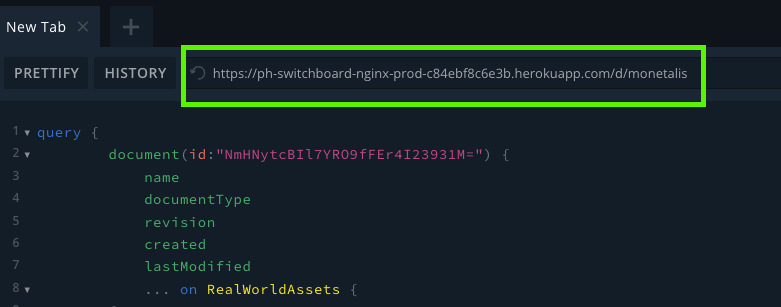

# Real World Assets Reports

## Overview

This documentation describes a GraphQL query for retrieving detailed information about a document model from Switchboard, specifically targeting documents related to Real World Assets (RWA). The query focuses on fetching an array of accounts, Special Purpose Vehicles (SPVs), fixed income types, fee types, portfolio details, and transactions associated with a particular document.

This page describes 2 different GraphQL queries for retrieving data from a Real World Asset Portfolio Report.

### Use Case

These queries are particularly useful for applications requiring in-depth analysis and reporting of real-world assets within the Switchboard Open API. It allows for the aggregation of comprehensive asset management data, aiding in financial analysis, auditing, and strategic planning.

The queries below focus on 2 different ways of receiving the data.
We will show how you can receive:

        1. The complete state of the document such as the array of accounts, Special Purpose Vehicles (SPVs), fixed income types, fee types, portfolio details, and transactions associated with a particular RWA-report.

        2. Only the latest changes and updates, or specific operations of a document by registering a listener with a specific filter.

### 1. Adding the specific Document Drive to Connect with an URL

The specific drive where your RWA-report is being stored can be accessed through Connect. Connect functions as your decentralised document drive to access and edit document models that capture the data present in your organisation.

Get access to an organisations drive instances by adding this drive to your Connect Drive navigation tree view. click the (+) icon behind 'Public Drives' to add the public drive with the help of the correct link. To add a new drive you'll have to get the correct URL for the drive. Please reach out to the Powerhouse team to get hold of the correct drive URL. Both public drives and secure cloud drives will be offered as centralised and decentralised solutions in the future.

### 2. Querying data from Connect in Switchboard

Whenever you want to start a query from a document within connect, that is hosted on switchboard, you can open up switchboard by looking for the switchboard logo in the top right hand corner of the document editor interface, or by clicking a document in the connect drive explorer and opening the document in switchboard. This feature will not be available for your local drives as they are not hosted on switchboard.


*Right click a document and find a direct link to switchboard GraphQL playground*

### 3. Querying data from Connect in Apollo Studio

Aside from switchboard you're also able to use GraphQL interfaces such as Apollo Studio.
When opening the document in switchboard the endpoint will be visible at the top of the interface. Copy this endpoint and use it as your API endpoint in Apollo.


*The endpoint you'll be using for any other GraphQL playgrounds or sandboxes*

### A. Querying the complete state of a document

This query is structured to request a document by its unique identifier (id). It extracts common fields such as id, name, documentType, revision, created, and lastModified.
Additionally, it retrieves specific data related to Real World Assets, including accounts, SPVs, fixed income types, fee types, portfolio, and transactions. The RWA section of the query is designed to pull in detailed information about the financial structure and transactions of real-world assets managed within the system.

<details>
  <summary>List of fields and retrievable data.</summary>

#### Common Document Fields

- `name`: The name of the document.
- `documentType`: The type classification of the document.
- `revision`: The version number of the document.
- `created`: The creation timestamp of the document.
- `lastModified`: The timestamp of when the document was last modified.

#### Real World Assets (RWA) Specific Fields

**State**

- `accounts`
  - `id`: Unique identifier for the account.
  - `reference`: Reference code or number associated with the account.
  - `label`: A user-friendly name or label for the account.
- `principalLenderAccountId`: Identifier for the principal lender's account.
- `spvs`
  - `id`: Unique identifier for the Special Purpose Vehicle (SPV).
  - `name`: Name of the SPV.
- `feeTypes`
  - `id`: Unique identifier for the fee type.
  - `name`: Name of the fee type.
  - `feeType`: The classification or category of the fee.
  - `accountId`: Identifier for the account associated with the fee.
- `fixedIncomeTypes`
  - `id`: Unique identifier for the fixed income type.
  - `name`: Name of the fixed income type.

  **Portfolio**

  **Fixed Income**

  - `id`: Unique identifier for the fixed income asset.
  - `fixedIncomeTypeId`: Identifier for the type of fixed income.
  - `name`: Name of the fixed income asset.
  - `spvId`: Identifier for the SPV associated with the fixed income asset.
  - `maturity`: Maturity date of the fixed income asset.
  - `purchaseDate`: Purchase date of the fixed income asset.
  - `notional`: The notional amount of the fixed income asset.
  - `purchasePrice`: Purchase price of the fixed income asset.
  - `purchaseProceeds`: Proceeds from the purchase of the fixed income asset.
  - `totalDiscount`: Total discount received for the fixed income asset.
  - `annualizedYield`: The annualized yield of the fixed income asset.
  - `ISIN`: International Securities Identification Number for the fixed income asset.
  - `CUSIP`: Committee on Uniform Securities Identification Procedures number for the fixed income asset.
  - `coupon`: Coupon rate of the fixed income asset.

  **Cash**

  - `id`: Unique identifier for the cash holding.
  - `spvId`: Identifier for the SPV associated with the cash holding.
  - `currency`: Currency of the cash holding

</details>

```graphql title="Query for full state"
  query {
  document(id: "") {
    name
    documentType
    revision
    created
    lastModified
    ... on RealWorldAssets {
      state {
        accounts {
          id
          reference
          label
        }
        principalLenderAccountId
        spvs {
          id
          name
        }
        serviceProviderFeeTypes {
          id
          name
          feeType
          accountId
        }
        fixedIncomeTypes {
          id
          name
        }
        portfolio {
          ... on FixedIncome {
            id
            fixedIncomeTypeId
            name
            spvId
            maturity
            purchaseDate
            notional
            purchasePrice
            purchaseProceeds
            totalDiscount
            annualizedYield
            ISIN
            CUSIP
            coupon
          }
          ... on Cash {
            id
            spvId
            currency
          }
        }
      }
    }
  }
}

```

### B. Querying for the latest updates or specific documents

This query is particularly useful when pulling only the latest changes from the document drive. 

1. For this purpose we support adding listeners through a graphQL mutation such as the PullResponderListenerbelow. 

```graphql
mutation registerListener($filter: InputListenerFilter!) {
  registerPullResponderListener(filter: $filter) {
    listenerId
  }
}
```

2. Through this listener you can define the filter with query variables. 
This allows you to filter for specific document ID's or a lists, documentTypes, scopes or branches. Branches allow you to query different versions of a document in case there is a conflict accross different versions of the document or when contributors are maintaining separate versions with the help of branching

    In this case we're filtering by document type makerdao/rwa-portfolio.

```graphql
{
  "filter":{
    "documentId": ["*"],
    "documentType": ["makerdao/rwa-portfolio"],
    "scope": "global",
    "branch": "main"
  }
}
```

3. his query + query variables will return a listenerID which can be used in the next step to query for specific strands. 


*An example of registering a listener and receiving a listenerId back.*

4. A strand in this scenario can be understood as a list of operations that has been applied to the RWA portfolio or any other document. As a query variable you'll want to add the received listenerId from the previous step together with the pullstrands query below

```graphql title="Pullstrands query"	
query pullStrands ($listenerId:ID, $since: Date) {
  system {
    sync {
      strands (listenerId: $listenerId, since: $since) {
        driveId
        documentId
        scope
        branch
        operations {
          index
          skip
          type
          input
          hash
          timestamp
        }
      }
    }
  }
}
```

```graphql title="Query variables for pullStrands"
{
  "listenerId":"7ef04e24-4466-4642-863d-4a71c29d30c7",
  "since":"2024-02-21T16:45:30.300Z"
}
```


*An example of using the ListenerID to pull specific strands (or document operations)* 

6. In case you'd only like to receive the latest operations of a document the latest timestamp can be used as a filter in the since query variable to only get the most relevant or latest changes. 

:::info
A "strand" within the context of Powerhouse's Document Synchronization Protocol also refers to a single synchronization channel that connects exactly one unit of synchronization to another, with all four parameters (drive_url, doc_id, scope, branch) set to fixed values. This setup means that synchronization happens at a granular level, focusing specifically on one precise aspect of synchronization between two distinct points of instances of a document or document drive.
:::